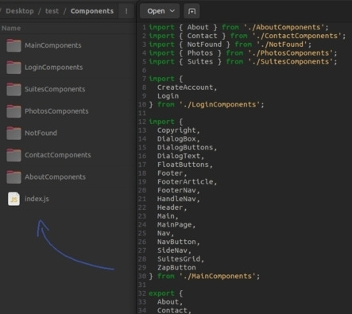

# BarrelGen


This script generates an index.js file that performs sorted module "barreling" of the files from any directory and subdirectories of the provided path. The "barrel" consists of creating an index file that exports all the components contained in a directory, making it easier to import them into other files. 



</section>

<h3>
  Install
</h3>

```
$ npm install -g barrelgen
```

<h4>
  To run the script use the following command
</h4>

```
$ barrelgen /path/to/directory
```


